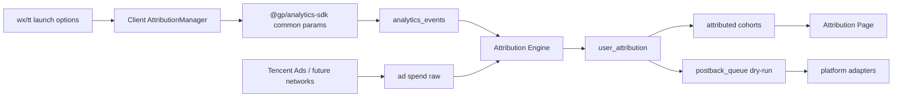

# 广告归因系统设计

## 总体架构

## 客户端

客户端新增 `AttributionManager`，只做三件事：

- 冷启动读取 `getLaunchOptionsSync()`，热启动监听 `onShow()`。
- 解析 query / scene / referrerInfo，持久化 first-touch 和 latest-touch。
- 向 SDK 注入公共参数，并主动上报 `attribution_touchpoint`。

公共参数字段保持短平快，避免污染事件体：

- `attr_provider`
- `attr_channel`
- `attr_campaign_id`
- `attr_adgroup_id`
- `attr_creative_id`
- `attr_click_id`
- `attr_launch_scene`
- `attr_match_source`

原始 query/referrer 只在 `attribution_touchpoint` 事件中保留，正式版后续可改为白名单或 hash。

## SDK

`@gp/analytics-sdk` 新增公共参数能力：

- `Analytics.setCommonParams(params)`
- `Analytics.clearCommonParams(keys?)`
- `Context` 保存 common params
- `buildEnvelope()` 合并公共参数和事件参数，事件参数优先

这保证后续水果、灵宠消消塔只要接入归因模块，不需要所有业务埋点手工传字段。

## 服务端

新增 `src/server/attribution-db.ts` 维护：

- `attribution_touchpoints`
- `user_attribution`
- `attributed_user_daily`
- `postback_queue`

新增 `src/server/metrics/attribution.ts`：

- 从 `analytics_events` 解析归因触点
- 按首触规则写 `user_attribution`
- 聚合归因维度的新增、留存、LTV、广告收入和深层事件
- 生成回传 dry-run 队列

## 归因规则

首期采用保守规则：

1. 有 `click_id` / `gdt_vid` / `cb` 的触点为确定性点击。
2. 有 campaign/adgroup/creative 但无 click id 的触点为参数归因，置信度中等。
3. 只有 launch scene / referrer 的触点为入口归因，置信度低。
4. 首个有效 acquisition 触点不被后续普通启动覆盖。
5. 无有效触点归为 `organic` 或 `unknown`。

## 回传

首期只做 dry-run：

- 事件进入 `postback_queue`
- `status = dry_run`
- 存储 payload、归因结果、dedupe key、平台事件名
- 不真实请求广告平台

默认回传候选：

- `first_open`
- `tutorial_complete`
- `first_order_deliver`
- `first_ad_show`
- `d1_retained`
- `d3_retained`
- `estimated_ltv_bucket`

## 调试

归因看板必须展示：

- 最近 touchpoint 原始参数
- 已解析字段
- 用户归因结果
- unknown / organic / fallback 占比
- dry-run postback payload

开发者工具验证目标是工程链路正确；真实字段仍需小预算广告探针确认。
